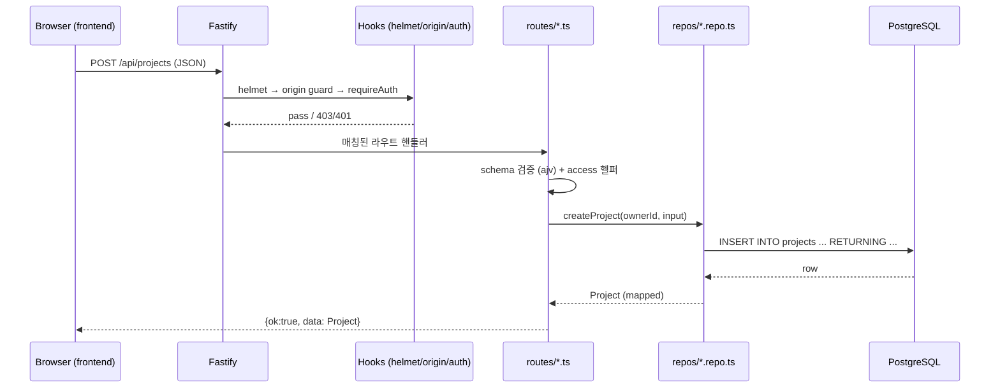
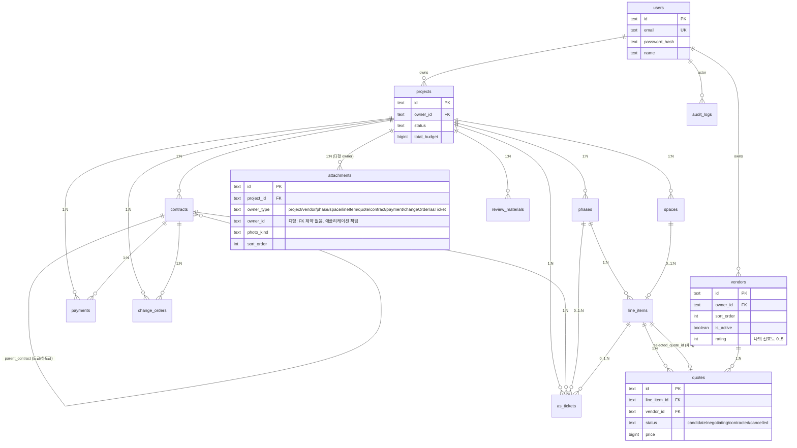

# 아키텍처

## 책임 1줄 정의

| 영역 | 책임 |
|---|---|
| `frontend/` | 사용자에게 화면 보여주고 입력 받음. 백엔드 호출. 그게 전부. |
| `backend/` | HTTP 요청 받음 → DB 작업 → JSON 반환. HTML 렌더 안 함. |
| `database/` | 데이터 저장. 제약조건. 끝. |
| `docs/` | API 계약과 아키텍처 문서. |

## 데이터 흐름

```text
[브라우저]
    ↓ HTTP (JSON)
[Fastify backend]
    ↓ SQL
[PostgreSQL]
```

- 프론트는 백엔드에 fetch로 JSON 요청
- 백엔드는 입력 검증 → repos 함수 호출 → JSON 응답
- 백엔드는 절대 HTML을 만들지 않음
- 프론트는 절대 SQL을 알지 못함

### 요청 흐름 (시퀀스)



### 인증 / 세션

```mermaid
sequenceDiagram
    participant B as Browser
    participant F as Fastify
    participant S as session store (PG)

    B->>F: POST /api/auth/login {email, password}
    F->>F: rate-limit, schema 검증
    F->>S: bcrypt 비교 + regenerate()
    S-->>F: 새 sid
    F-->>B: Set-Cookie: sid=...; HttpOnly; SameSite=Lax; Secure(prod)
    Note over B,F: 이후 모든 요청에 sid 쿠키 자동 포함
    B->>F: GET /api/projects (Cookie: sid)
    F->>S: SELECT sess FROM session WHERE sid=$1
    S-->>F: { userId }
    F->>F: requireAuth pass
```

## ER 다이어그램



다형 association(`attachments.owner_type` + `owner_id`)은 FK 제약을 걸 수 없어 라우트에서 `ownerBelongsToProject` 검증이 무결성 책임. 추후 owner_type별 분리 테이블로 이전 검토.

## 디렉토리 임포트 규칙

```text
frontend/  →  (외부 통신은 HTTP로만)
backend/   →  database/ (마이그레이션 도구가 사용)
docs/      →  (참조만, 실행 안 됨)
```

- `frontend` 가 `backend` import 금지 (다른 process)
- `backend` 가 `frontend` import 금지

## 변경 절차

### API 추가/변경

1. `docs/api-contract.openapi.yaml` 수정 (계약 우선)
2. 백엔드: `routes/` + `repos/` 구현, schema 검증 추가
3. 프론트: `api.js` 에 함수 추가, `modules/` 에서 호출
4. 양쪽 typecheck 통과 확인

### DB 변경

1. `docs/api-contract.openapi.yaml` 영향 검토 후 먼저 수정
2. `database/migrations/{NNN}_{name}.sql` 추가
3. `database/schema.sql` 갱신 (최신 전체 스키마 유지)
4. `backend/repos/` 영향 코드 수정

## 도메인 규칙

### 견적 채택 (`POST /api/quotes/{id}/select`)

라인 항목당 한 견적만 채택 상태가 된다. 채택은 **두 필드를 동시에** 갱신:

- `quotes.selected_at` — 채택 시각. 같은 `line_item_id` 의 다른 견적은 NULL 로 초기화.
- `line_items.selected_quote_id` — 라인 항목이 가리키는 채택 견적의 FK.

**`quotes.status` 는 채택과 별개로 사용자가 수동 관리한다.** select API 가 status 를 자동으로 `'contracted'` 로 바꾸지 않으며, 다른 견적의 status 를 `'cancelled'` 로 자동 변경하지도 않는다. 의도적인 분리:

- 채택 = 어떤 견적을 메인으로 보여줄지
- status = 협상 단계의 라이프사이클 (candidate → negotiating → contracted | cancelled)

이렇게 분리하지 않으면 "협상중인 후보를 일시 채택" 같은 자연스러운 운영을 할 수 없다.

### 첨부 업로드

현재 정책: 프론트가 base64 data URL 로 직렬화 → JSON body 로 `POST /api/projects/{id}/attachments` → `attachments.blob_url` 컬럼에 그대로 저장.

- 단일 첨부 5MB 제한 (`backend/src/routes/attachments.routes.ts` `MAX_BLOB_URL_BYTES`)
- 실제 파일은 base64 오버헤드 33% 감안해 ~3.7MB
- 추후 디스크 / S3 로 옮기게 되면 `@fastify/multipart` + 별도 업로드 라우트로 전환

업체 프로필 사진은 별도 정책을 쓴다. 프론트가 `photoDataUrl` 로 전송하면 서버가 `uploads/vendor-profiles/` 에 파일로 저장하고, `vendors.photo_url` 에는 `/uploads/vendor-profiles/{vendorId}.{ext}` 공개 URL 만 남긴다. 업체 목록 API 가 base64 payload 를 반복 전송하지 않도록 하기 위한 분리다.

### 정렬 (`sort_order`)

`phases`, `spaces`, `line_items`, `review_materials` 는 프로젝트 / 공정 단위 `UNIQUE (parent_id, sort_order)` 제약. 재정렬은 두 단계 UPDATE:

1. 대상 행을 음수 임시값(`-100000 - ordinal`) 으로 옮겨 UNIQUE 충돌 회피
2. 0 부터 시작하는 최종 sort_order 부여

트랜잭션 내에서 처리.

`attachments` 는 다른 패턴: 단일 UPDATE + `unnest(orderedIds) WITH ORDINALITY` 로 한 번에 갱신. UNIQUE 는 `(owner_type, owner_id, kind, sort_order)` 단위이고 `DEFERRABLE INITIALLY DEFERRED` 라 statement 끝(commit 시점) 검사 → 단일 statement 내 swap 도 안전.

`vendors` 는 사용자(owner) 단위 `sort_order` 를 가진다. 아직 가족/소규모 단계라 UNIQUE 제약은 두지 않고, `ORDER BY sort_order, name` 으로 표시 순서를 고정한다. `is_active=false` 업체는 기존 견적/계약 참조 보존을 위해 삭제하지 않고, 새 비교 업체 선택 목록에서 제외한다.

### 마이그레이션 정책

- `database/migrations/*.sql` 은 **DDL 만**. 컬럼/테이블/인덱스/제약 변경.
- 데이터 백필 (label 기반 자동 분류, 환경 의존 한국어 키 등) 은 `backend/src/scripts/backfill-*.ts` 로 분리.
- 새 환경 (테스트, 신규 dev) 에서 마이그레이션을 적용해도 데이터 부수효과 0.
- 운영 일회성 백필은 `backend/src/scripts/` 의 명령으로, `--dry` / `--confirm` 가드 적용.
- `schema_migrations` 테이블이 적용 이력 추적 (`backend/src/scripts/migrate.ts` 가 자동 INSERT).

역사적 예외: `008/009/010` 마이그레이션은 초기 정리 과정에서 DDL 과 데이터 보정 UPDATE 가 함께 들어간 상태로 이미 배포될 수 있다. 적용 이력 보존을 위해 기존 파일을 되쓰지 않고, 같은 데이터 보정 로직은 `backend/src/scripts/backfill-line-items.ts` 로도 유지한다. 이후 신규 마이그레이션에는 DML 을 넣지 않는다.

### 무결성 제약

- `quotes_one_contracted_per_line` 부분 UNIQUE: 같은 `line_item_id` 에 `status='contracted'` 인 견적은 최대 1건.
- `attachments_owner_sort_unique` UNIQUE (DEFERRABLE): owner 단위 정렬 충돌 방지.
- `vendors_owner_name_unique`: 한 사용자가 같은 이름 업체 중복 생성 차단.
- `vendors_owner_sort_idx`: 업체관리 표시 순서 조회 최적화.
- `users_email_lower_idx` UNIQUE: 케이스 무관 이메일 중복 차단 (`Foo@x.com` ↔ `foo@x.com`).

## 보안 / 인증

- 세션은 PostgreSQL `session` 테이블에 영속 (`connect-pg-simple`).
- 쿠키: `httpOnly`, `sameSite=lax`, `secure` 는 `NODE_ENV=production` 에서 자동 강제.
- `SESSION_SECRET` 는 production 에서 dev 기본값/32자 미만이면 부팅 실패.
- signup/login 만 rate-limit (10/min).
- signup/login 시 `req.session.regenerate()` 로 session fixation 방지.
- 모든 mutation 에 Origin/X-Forwarded-Host 일치 검증 (CSRF 추가 보호).
- 5xx 에러 메시지는 클라이언트에 마스킹 (pg 내부 구조 누설 차단), 상세는 `req.log.error` 로만.
- audit log fail-open: `audit_logs` INSERT 실패가 사용자 액션을 막지 않음 (감사 부재 < UX 망가뜨림).

## 가드레일 테스트

`backend/src/tests/project-guardrails.test.ts` 가 정책을 정적으로 강제:

- 마이그레이션 번호 유일성
- `schema.sql` 에 `DROP CONSTRAINT` 같은 마이그레이션 잔재 차단 (current-state)
- `routes/*` 에 SQL 직접 사용 차단
- `lib/*` 에도 SQL 차단 (audit, access 가 다시 새는 것 방지)
- helmet, rate-limit, session.regenerate, audit 호출, security headers 검증

새 변경이 룰을 깨면 `npm test` 가 즉시 실패.

## React 전환 기준

`CLAUDE.md`의 "React 전환 기준" 4개 중 2개 이상 충족 시 검토.
충족 전엔 vanilla 유지.
